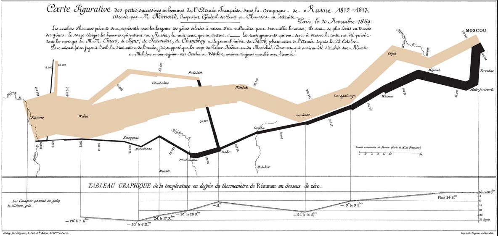

```{r setup, include=FALSE}
options(htmltools.dir.version = FALSE)
library(xaringanthemer)
style_solarized_light(
  code_font_size = "0.7rem",
  code_inline_font_size = "0.9rem"
)
xaringanExtra::use_clipboard()
xaringanExtra::use_fit_screen()

library(flipbookr)
library(tidyverse)
library(palmerpenguins)
library(ggiraph)
```

class: middle, center

## Julia Romanowska

### biostatystyka, wizualizacje, data scientist

### współzałożycielka R-Ladies Bergen

**Uniwersytet w Bergen, Norwegia**

https://jrom.bitbucket.io/homepage/

---

## INFO

- [github repozytorium](https://github.com/jromanowska/Wizualizacje_R) z kodem i tą prezentacją

---

class: left, inverse, bottom

# PLAN

## Wstęp - jak projektować grafikę?
## Krótko o ggplot2
## Interaktywne grafy
### na szybko
### i trochę wolniej / zaawansowane techniki

---

*For a graph to be effective, it must be easy for its audience to decode and interpret.*    
[Duke, S. P. et al. Stat.Med. 34 (2015)](https://doi.org/10.1002/sim.6549)




<p style="font-size: small; font-style: italic;">[src: Charles Joseph Minard, Napoleon’s March InfoGraphic]</p>

---

## Wstęp - jak projektować grafikę?

- eksploruj dane
- wypróbuj różne typy grafów **na kartce!**
- wybierz kolorystykę
- jaką wiadomość przekazuje grafika?

--

- dobre książki:

    - ["Info We Trust", RJ Andrews](https://www.amazon.com/Info-We-Trust-Inspire-World/dp/1119483891)
    - ["Storytelling with Data"](https://www.amazon.com/Storytelling-Data-Visualization-Business-Professionals/dp/1119002257) and ["Storytelling with Data / Let's practice!"](https://www.amazon.com/Storytelling-Data-Cole-Nussbaumer-Knaflic/dp/1119621496), Cole Nussbaumer Knaflic

---

class: inverse, left, middle

## ggplot2 i rozszerzenia

---

```{r penguins_species, include = FALSE}
ggplot(data = penguins) +
  aes(x = bill_length_mm,
    y = bill_depth_mm) +
  geom_point(
    aes(color = species,
    shape = species),
      size = 2) + 
  geom_smooth(method = "lm",
    se = FALSE,
    aes(color = species))
penguins_default <- last_plot()
```

`r chunk_reveal("penguins_species", break_type = "auto", chunk_options = "warning = FALSE", font_size_code = "50%")`

---

```{r penguins_species2, include = FALSE}
penguins_default +
  scale_color_manual(
    values = c("darkorange",
               "darkorchid",
               "cyan4")
    ) +
  facet_grid(rows = vars(species)) +
  labs(title = 
    "Penguin species differentation") +
  labs(subtitle = 
    "based on bill depth and bill length") +
  xlab("bill length (mm)") +
  ylab("bill depth (mm)") +
  theme_minimal() +
  theme(
    plot.title =
      element_text(face = "bold"),
    plot.subtitle =
      element_text(face = "italic")) +
  theme(legend.position = "none")
```

`r chunk_reveal("penguins_species2", break_type = "auto", chunk_options = "warning = FALSE", font_size_code = "50%")`

---

## tips and tricks

- **kolory**
  - [ColorBrewer](https://colorbrewer2.org)    
  wbudowane w ggplot2 [`scale_color_brewer`](https://ggplot2.tidyverse.org/reference/scale_brewer.html)
  - [sanzo palette](https://github.com/jmaasch/sanzo)    
  można zainstalować z CRANa
  - mnóstwo innych możliwości: np. [paletteer](https://emilhvitfeldt.github.io/paletteer/)

- **roszerzenia**
  - [ggrepel](https://ggrepel.slowkow.com/)    
  ładniejsze pozycjonowanie napisów
  - [gggenes](https://wilkox.org/gggenes/)    
  wizualizacja genów jako strzałek
  - mnóstwo innych możliwości: [ggextensions](https://exts.ggplot2.tidyverse.org/gallery/)

---

class: inverse, left, middle

# Interaktywne grafy

## na szybko

---

<div style="float: right; position: fixed; right: 10px; top: 10px;">
<br>
</div>

## ggiraph

https://davidgohel.github.io/ggiraph

- do gotowego grafu `ggplot` dodaje interaktywność
- rozszerza `ggplot2` o `geom`y:
    - `geom_point_interactive`
    - `geom_tile_interactive`
    - `scale_fill_manual_interactive`
    - i wiele więcej

---

```{r}
penguins
```

---

```{r}
penguins_int <- penguins %>%
  mutate(hover_text =
    paste0("This ", sex,
      " lives at ", island,
      " and was measured in ", year))
penguins_int %>%
  select(hover_text)
```

---

```{r ggiraph_test, include=FALSE}
penguins_int_plot <- ggplot(
    data = penguins_int
  ) +
  aes(x = bill_length_mm,
    y = bill_depth_mm) +
  geom_point_interactive( #<<
    aes(color = species,
    shape = species,
    tooltip = hover_text), #<<
      size = 2) + 
  geom_smooth(method = "lm",
    se = FALSE,
    aes(color = species)) +
  scale_color_manual(
    values = c(
      "darkorange",
      "darkorchid",
      "cyan4")) +
  labs(title = 
    "Penguin species differentation") +
  xlab("bill length (mm)") +
  ylab("bill depth (mm)") +
  theme_minimal() +
  theme(
    plot.title =
      element_text(face = "bold"),
    plot.subtitle =
      element_text(face = "italic")) + 
  theme(legend.position = "bottom") #BREAK
girafe(ggobj = penguins_int_plot) #BREAK
```

`r chunk_reveal("ggiraph_test", break_type = "user", font_size_code = "50%", chunk_options = "warning = FALSE")`

---

<div style="float: right; position: fixed; right: 10px; top: 10px;">
<br>
</div>

## ggplotly

- [Plotly + ggplot2](https://plotly.com/ggplot2/)

---

```{r ggplotly_test, include=FALSE}
penguins_int_plot <- ggplot(
    data = penguins_int #<<
  ) +
  aes(x = bill_length_mm,
    y = bill_depth_mm,
    text = hover_text) + #<<
  geom_point(
    aes(color = species,
    shape = species),
      size = 2) + 
  scale_color_manual(
    values = c(
      "darkorange",
      "darkorchid",
      "cyan4")) +
  labs(title = 
    "Penguin species differentation") +
  xlab("bill length (mm)") +
  ylab("bill depth (mm)") +
  theme_minimal() +
  theme(plot.title =
    element_text(face = "bold")) #BREAK
plotly::ggplotly( #<<
  penguins_int_plot, #<<
  tooltip = "text") #BREAK
```

`r chunk_reveal("ggplotly_test", break_type = "user", font_size_code = "50%", chunk_options = "warning = FALSE")`

---

class: inverse, left, middle

# Interaktywne grafy

## zaawansowane

---

<div style="float: right; position: fixed; right: 10px; top: 10px;">
<br>
</div>

## highcharter

https://jkunst.com/highcharter/

- implementacja R biblioteki javascript [`highcharts`](https://www.highcharts.com/demo)
- trochę jak ggplot:

    - dodajemy warstwy danych funkcją `hc_add_series`
    - dodajemy warstwy wizualne funkcją `hcaes`
    - szybkie rysowanie przez funkcję `hchart`
    - dodajemy elementy przez odpowiednie funkcje `hc_`,    
    np. `hc_title` dodaje tytuł,    
    `hc_colorAxis` definiuje paletę kolorów i dodaje legendę

--

- mnóstwo przykładów:    
https://jkunst.com/highcharter/articles/showcase.html

- bardziej zaawansowany przykład:    
https://jrom.bitbucket.io/showcase/
- kod: https://bitbucket.org/jrom/jrom.bitbucket.io/src/master/showcase/index.Rmd

---

## Interaktywny Rmarkdown

- [flexdashboard](https://rmarkdown.rstudio.com/flexdashboard/index.html)

    - Rmarkdown z ekstra opcjami
    - dzięki `htmlwidgets` można łatwo umieszczać interaktywne komponenty
    - dzięki `crosstalk` można łączyć komponenty

- [htmlwidgets](https://www.htmlwidgets.org/)

    - wybierz spośród gotowych funkcji R
    - kompilacja do JS i HTML

- [crosstalk](https://rstudio.github.io/crosstalk/)

    - dodaj zależności pomiędzy komponentami

---

```yaml
---
title: "Interactive results"
output: 
  flexdashboard::flex_dashboard:
    orientation: columns
    vertical_layout: scroll
    theme: paper
---

Column {.tabset}
-----------------------------------------------------------------------

``{r}
# twój kod z np. ggplotly
``
```

[Kliknij tu, żeby zobaczyć przykład](flexdashboard_penguins.html)
